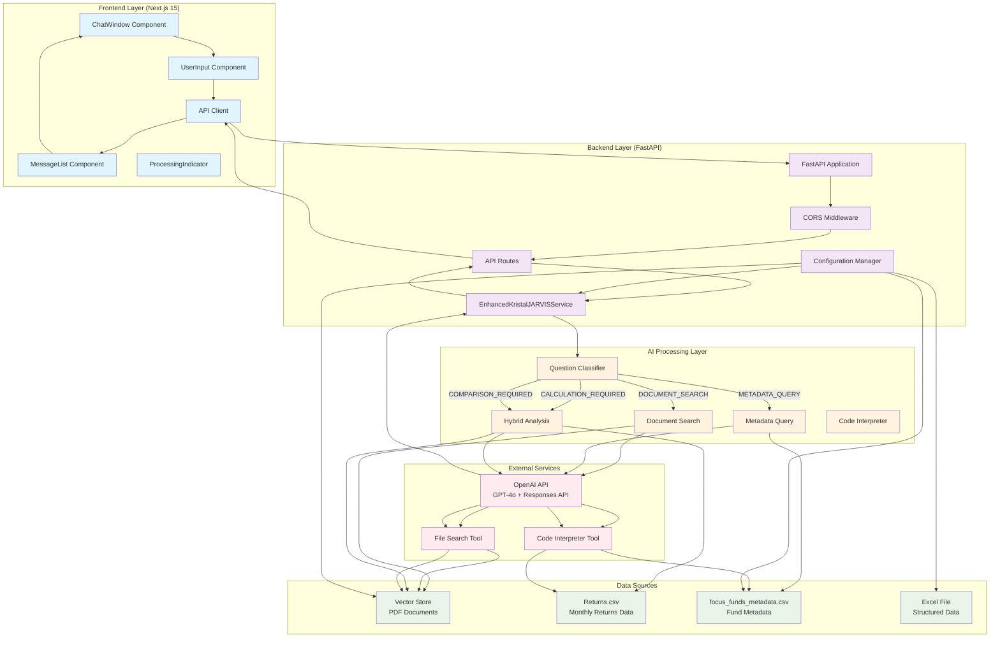

# Kristal.AI's J.A.R.V.I.S System Architecture

## System Overview
This is an AI-powered fund analysis system that combines document search, financial calculations, and metadata queries to provide comprehensive fund insights.

## Architecture Diagram

## Information Flow Examples

### Example 1: Document Search Query
**User Question**: "What is the investment strategy of the Point72 fund?"

1. **Frontend**: User types question in ChatWindow
2. **API Call**: POST to `/api/ask` with question
3. **Classification**: Question classified as "DOCUMENT_SEARCH"
4. **Document Search**: 
   - OpenAI API called with file_search tool
   - Vector store searched for relevant PDF documents
   - GPT-4o analyzes document content
5. **Response**: Structured answer with source citations
6. **Display**: MessageList shows formatted response

### Example 2: Financial Calculation Query
**User Question**: "Calculate the Sharpe ratio for Point72 fund"

1. **Frontend**: User submits calculation request
2. **Classification**: Question classified as "CALCULATION_REQUIRED"
3. **Hybrid Analysis**:
   - Document search for context
   - Code interpreter loads Returns.csv data
   - Python code calculates Sharpe ratio using actual returns
   - Visualization generated if needed
4. **Response**: Calculated metric with formula and methodology
5. **Display**: Response with potential charts/images

### Example 3: Metadata Query
**User Question**: "List all hedge funds available"

1. **Frontend**: User asks for fund listing
2. **Classification**: Question classified as "METADATA_QUERY"
3. **Metadata Processing**:
   - Code interpreter loads focus_funds_metadata.csv
   - Filters for Instrument Type = "Hedge Fund"
   - Creates structured table with fund details
4. **Response**: Formatted table with fund names and details
5. **Display**: Markdown-formatted table in chat

## Key Components

### Frontend (Next.js 15)
- **ChatWindow**: Main interface component
- **UserInput**: Text input with send functionality
- **MessageList**: Displays conversation history
- **ProcessingIndicator**: Shows processing stages
- **API Client**: Handles backend communication

### Backend (FastAPI)
- **EnhancedKristalJARVISService**: Core AI service
- **Question Classifier**: Determines processing approach
- **CORS Middleware**: Handles cross-origin requests
- **Configuration Manager**: Manages environment variables

### AI Processing
- **Document Search**: Uses OpenAI file_search tool
- **Metadata Query**: Uses code interpreter with CSV data
- **Hybrid Analysis**: Combines document search + calculations
- **Code Interpreter**: Executes Python code for calculations

### Data Sources
- **Vector Store**: Contains PDF documents (fund factsheets, marketing docs)
- **Returns.csv**: Monthly returns data for all funds
- **Metadata CSV**: Fund metadata (names, types, geographies, strategies)
- **Excel File**: Additional structured data

## Processing Stages

1. **Searching**: Document search and data loading
2. **Calculating**: Code interpreter execution for calculations
3. **Analyzing**: Data analysis and insight generation
4. **Complete**: Final response formatting and delivery

## Error Handling

- **Configuration Errors**: Missing API keys or file IDs
- **API Errors**: OpenAI service failures
- **Data Errors**: Missing or corrupted data files
- **Network Errors**: Connection issues between frontend and backend

## Security Features

- **CORS Configuration**: Restricted to specific domains
- **Input Validation**: Pydantic models for request/response validation
- **Error Sanitization**: Safe error messages without sensitive data
- **Environment Variables**: Secure configuration management
