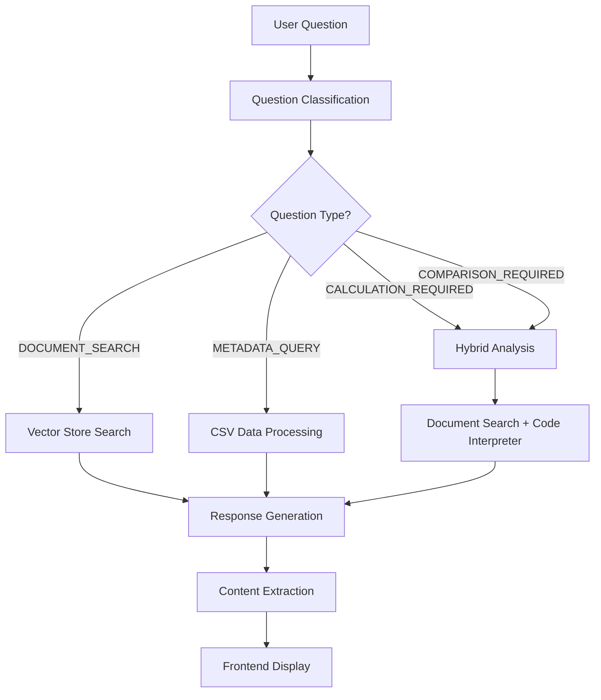

# Kristal.AI's J.A.R.V.I.S - Comprehensive AI System Architecture

A detailed technical guide for building sophisticated AI-powered applications that can be adapted for Gemini, Claude, or other AI models.

## 🏗️ System Architecture Overview

This system implements a **hybrid AI architecture** that combines multiple AI capabilities:

- **Document Search**: Vector-based semantic search through PDF documents
- **Code Interpreter**: Python execution for financial calculations
- **Metadata Query**: Structured data processing and filtering
- **Question Classification**: Intelligent routing to appropriate processing paths
- **Response Generation**: Context-aware answer synthesis with visualizations

## 🧠 Core AI Processing Patterns

### 1. Question Classification System

The system uses **keyword-based classification** to route questions to appropriate processing paths:

```python
def classify_question(self, question: str) -> str:
    """Classify question type to determine processing approach."""
    
    # Metadata query keywords
    metadata_keywords = [
        "list", "show", "which", "what funds", "available", "funds in",
        "geography", "asset type", "instrument type", "strategy", "sub-category"
    ]
    
    calculation_keywords = [
        "calculate", "compute", "max drawdown", "sharpe ratio",
        "volatility", "vol", "annualized", "correlation", "beta", "alpha"
    ]
    
    # Classification logic
    if any(keyword in question.lower() for keyword in calculation_keywords):
        return "CALCULATION_REQUIRED"
    elif any(keyword in question.lower() for keyword in metadata_keywords):
        return "METADATA_QUERY"
    elif "compare" in question.lower():
        return "COMPARISON_REQUIRED"
    else:
        return "DOCUMENT_SEARCH"
```

**For Gemini Implementation**: Replace with Gemini's classification capabilities or use a separate classification model.

### 2. Three-Tier Processing Architecture

#### Tier 1: Document Search Only
```python
async def search_documents_only(self, question: str) -> dict:
    """Search documents only (no calculations)"""
    response = client.responses.create(
        model="gpt-4o",
        input=question,
        instructions=self.get_document_search_instructions(),
        tools=[{"type": "file_search", "vector_store_ids": [self.vector_store_id]}],
        max_tool_calls=5
    )
    return self.extract_response_content(response)
```

#### Tier 2: Metadata Query Processing
```python
async def query_metadata(self, question: str) -> dict:
    """Query fund metadata using code interpreter with CSV data."""
    
    metadata_instructions = f"""
    You are J.A.R.V.I.S, an AI assistant for fund metadata analysis.
    
    ## AVAILABLE DATA:
    **Fund Metadata CSV Data:**
    {self.metadata_csv_data}
    
    ## USER QUESTION: 
    {question}
    
    ## TASK:
    Analyze the fund metadata CSV data to answer the user's question about funds.
    """
    
    response = client.responses.create(
        model="gpt-4o",
        input=question,
        instructions=metadata_instructions,
        tools=[{"type": "code_interpreter", "container": {"type": "auto"}}],
        max_tool_calls=5
    )
    return self.extract_response_content(response)
```

#### Tier 3: Hybrid Analysis (Document + Calculations)
```python
async def hybrid_analysis(self, question: str, document_context: str) -> dict:
    """Combine document search with Excel calculations"""
    
    enhanced_instructions = f"""
    You are J.A.R.V.I.S, Kristal.AI's specialized AI assistant for fund analysis.
    
    ## AVAILABLE DATA:
    **Returns Data**: CSV with monthly returns for all funds
    {self.csv_data}
    
    ## PROCESSING APPROACH:
    1. Load and analyze the returns data from the CSV data provided
    2. Calculate the requested financial metrics accurately using the actual data
    3. Provide exact formulas and methodology used for calculations
    4. Create visualizations for complex metrics (charts, graphs, plots)
    """
    
    response = client.responses.create(
        model="gpt-4o",
        input=question,
        instructions=enhanced_instructions,
        tools=[
            {"type": "file_search", "vector_store_ids": [self.vector_store_id]},
            {"type": "code_interpreter", "container": {"type": "auto"}}
        ],
        max_tool_calls=10
    )
    return self.extract_response_content(response)
```

## 🔧 Technical Implementation Details

### Data Sources and Processing

#### 1. Vector Store Management
```python
def create_vector_store(self) -> str:
    """Create a vector store for the Responses API file search."""
    file_ids = [file_info["file_id"] for file_info in self.uploaded_files 
                if file_info.get("type") != "csv"]
    
    vector_store = self.client.vector_stores.create(
        name="Fund Documents Vector Store",
        file_ids=file_ids
    )
    return vector_store.id
```

#### 2. CSV Data Processing
```python
def load_csv_data(self) -> str:
    """Load CSV data from the Returns.csv file."""
    csv_path = Path("Returns/Returns.csv")
    
    with open(csv_path, 'r', encoding='utf-8') as f:
        csv_data = f.read()
    return csv_data
```

#### 3. Metadata Processing
```python
def load_metadata_csv_data(self) -> str:
    """Load CSV data from the focus_funds_metadata.csv file."""
    metadata_path = Path("metadata/focus_funds_metadata.csv")
    
    with open(metadata_path, 'r', encoding='utf-8') as f:
        csv_data = f.read()
    return csv_data
```

### Response Processing and Content Extraction

```python
def extract_response_content(self, response) -> dict:
    """Extract content and images from OpenAI response"""
    content = ""
    images = []
    
    if hasattr(response, 'output') and response.output and len(response.output) > 0:
        for item in response.output:
            if hasattr(item, 'content') and item.content:
                if len(item.content) > 0:
                    content += item.content[0].text
            
            if hasattr(item, 'code_interpreter_outputs'):
                for output in item.code_interpreter_outputs:
                    if hasattr(output, 'image') and hasattr(output.image, 'data'):
                        images.append(output.image.data)
    
    return {
        "content": content if content else "No response generated",
        "images": images
    }
```

## 🎨 Frontend Architecture Patterns

### 1. Real-time Processing Indicators

```typescript
const [processingStage, setProcessingStage] = useState<'searching' | 'calculating' | 'analyzing' | 'complete'>('searching')

// Simulate processing stages
const isCalculationQuestion = content.toLowerCase().includes('calculate') || 
                            content.toLowerCase().includes('max drawdown')

if (isCalculationQuestion) {
    setProcessingStage('searching')
    await new Promise(resolve => setTimeout(resolve, 1000))
    
    setProcessingStage('calculating')
    await new Promise(resolve => setTimeout(resolve, 2000))
    
    setProcessingStage('analyzing')
    await new Promise(resolve => setTimeout(resolve, 1000))
}
```

### 2. Message Processing and Display

```typescript
const handleSendMessage = useCallback(async (content: string) => {
    // Add user message
    const userMessage: Message = {
        id: Date.now().toString(),
        role: 'user',
        content,
        timestamp: new Date()
    }
    
    setMessages(prev => [...prev, userMessage])
    setIsLoading(true)
    
    // Add typing indicator
    const typingMessage: Message = {
        id: (Date.now() + 1).toString(),
        role: 'assistant',
        content: '',
        timestamp: new Date(),
        isTyping: true,
        processingStage: 'searching'
    }
    
    try {
        const result = await askQuestion(content)
        
        // Remove typing indicator and add real response
        setMessages(prev => prev.filter(msg => msg.id !== typingMessage.id))
        
        const assistantMessage: Message = {
            id: (Date.now() + 2).toString(),
            role: 'assistant',
            content: result.answer,
            timestamp: new Date(),
            processingStage: 'complete',
            images: result.images
        }
        
        setMessages(prev => [...prev, assistantMessage])
    } catch (err) {
        // Error handling
    }
}, [])
```

### 3. Markdown Rendering with Custom Components

```typescript
function formatMessageContent(content: string, isUser: boolean = false): string {
    // Handle tables
    return content
        .replace(/([^\n]*\|[^\n]*\n?)+/g, (match) => {
            // Convert markdown tables to HTML
            const lines = match.trim().split('\n').filter(line => line.trim())
            let tableHtml = '<div class="overflow-x-auto my-6"><table class="min-w-full border-collapse border border-slate-300 bg-white rounded-lg shadow-sm">'
            
            lines.forEach((line, index) => {
                const cells = line.split('|').map(cell => cell.trim()).filter(cell => cell)
                const isHeader = index === 0
                const tag = isHeader ? 'th' : 'td'
                
                tableHtml += `<tr class="${isHeader ? 'bg-slate-50' : 'hover:bg-slate-25'}">`
                cells.forEach(cell => {
                    tableHtml += `<${tag} class="border border-slate-300 px-4 py-3">${cell}</${tag}>`
                })
                tableHtml += `</tr>`
            })
            
            tableHtml += '</table></div>'
            return tableHtml
        })
        // Handle headers, bold, italic, lists, etc.
}
```

## 🔄 Data Flow Architecture

### 1. Request Processing Flow



### 2. AI Tool Integration Pattern

```python
# Pattern for integrating multiple AI tools
tools_config = {
    "document_search": {
        "type": "file_search",
        "vector_store_ids": [vector_store_id],
        "max_calls": 5
    },
    "code_interpreter": {
        "type": "code_interpreter",
        "container": {"type": "auto"},
        "max_calls": 5
    },
    "hybrid": {
        "tools": [
            {"type": "file_search", "vector_store_ids": [vector_store_id]},
            {"type": "code_interpreter", "container": {"type": "auto"}}
        ],
        "max_calls": 10
    }
}
```

## 🚀 Deployment Architecture

### Backend (Railway + FastAPI)

```python
# CORS Configuration
app.add_middleware(
    CORSMiddleware,
    allow_origins=[
        "http://localhost:3000", 
        "http://127.0.0.1:3000",
        "https://your-vercel-app.vercel.app",
        "https://your-railway-app.railway.app"
    ],
    allow_credentials=True,
    allow_methods=["GET", "POST", "PUT", "DELETE", "OPTIONS"],
    allow_headers=["*"],
)

# Error Handling
@app.exception_handler(HTTPException)
async def http_exception_handler(request, exc):
    return JSONResponse(
        status_code=exc.status_code,
        content={
            "error": exc.detail,
            "detail": f"Status code: {exc.status_code}"
        }
    )
```

### Frontend (Vercel + Next.js 15)

```typescript
// API Client Pattern
export async function askQuestion(question: string): Promise<{ answer: string; images: string[] }> {
    const response = await fetch(`${API_BASE_URL}/api/ask`, {
        method: 'POST',
        headers: {
            'Content-Type': 'application/json',
        },
        body: JSON.stringify({ question }),
    })

    if (!response.ok) {
        const errorData: ErrorResponse = await response.json()
        throw new ApiError(
            errorData.error || 'Failed to get answer',
            response.status,
            errorData.detail
        )
    }

    const data: AnswerResponse = await response.json()
    return {
        answer: data.answer,
        images: data.images || []
    }
}
```

## 🔧 Adapting for Gemini/Other AI Models

### 1. Replace OpenAI Client

```python
# For Gemini
from google.generativeai import GenerativeModel
import google.generativeai as genai

# Configure Gemini
genai.configure(api_key=config.gemini_api_key)
model = GenerativeModel('gemini-1.5-pro')

# Replace OpenAI calls
def call_gemini_with_tools(prompt, tools=None):
    response = model.generate_content(
        prompt,
        tools=tools,
        generation_config={
            "temperature": 0.1,
            "top_p": 0.8,
            "top_k": 40,
            "max_output_tokens": 8192,
        }
    )
    return response
```

### 2. Adapt Tool Integration

```python
# Gemini tool configuration
gemini_tools = [
    {
        "function_declarations": [
            {
                "name": "search_documents",
                "description": "Search through fund documents",
                "parameters": {
                    "type": "object",
                    "properties": {
                        "query": {"type": "string"},
                        "vector_store_id": {"type": "string"}
                    }
                }
            },
            {
                "name": "execute_python_code",
                "description": "Execute Python code for calculations",
                "parameters": {
                    "type": "object",
                    "properties": {
                        "code": {"type": "string"},
                        "data": {"type": "string"}
                    }
                }
            }
        ]
    }
]
```

### 3. Response Processing Adaptation

```python
def extract_gemini_response(response):
    """Extract content from Gemini response"""
    content = ""
    images = []
    
    if hasattr(response, 'text'):
        content = response.text
    
    if hasattr(response, 'parts'):
        for part in response.parts:
            if hasattr(part, 'inline_data'):
                images.append(part.inline_data.data)
    
    return {
        "content": content,
        "images": images
    }
```

## 📊 Performance Optimization Patterns

### 1. Caching Strategy

```python
from functools import lru_cache
import hashlib

@lru_cache(maxsize=100)
def get_cached_response(question_hash: str, question_type: str):
    """Cache responses for similar questions"""
    pass

def process_question_with_cache(question: str):
    question_hash = hashlib.md5(question.encode()).hexdigest()
    question_type = classify_question(question)
    
    # Check cache first
    cached = get_cached_response(question_hash, question_type)
    if cached:
        return cached
    
    # Process and cache result
    result = process_question(question)
    return result
```

### 2. Async Processing

```python
import asyncio
from concurrent.futures import ThreadPoolExecutor

async def parallel_document_search(question: str, vector_stores: list):
    """Search multiple vector stores in parallel"""
    tasks = []
    for vs_id in vector_stores:
        task = search_vector_store(question, vs_id)
        tasks.append(task)
    
    results = await asyncio.gather(*tasks)
    return combine_results(results)
```

### 3. Streaming Responses

```python
from fastapi.responses import StreamingResponse
import json

async def stream_response(question: str):
    """Stream AI response as it's generated"""
    async def generate():
        async for chunk in ai_client.stream_response(question):
            yield f"data: {json.dumps({'content': chunk})}\n\n"
    
    return StreamingResponse(
        generate(),
        media_type="text/plain",
        headers={"Cache-Control": "no-cache"}
    )
```

## 🛡️ Security and Error Handling

### 1. Input Validation

```python
from pydantic import BaseModel, validator
import re

class QuestionRequest(BaseModel):
    question: str
    
    @validator('question')
    def validate_question(cls, v):
        if len(v.strip()) < 3:
            raise ValueError('Question too short')
        if len(v) > 2000:
            raise ValueError('Question too long')
        
        # Sanitize input
        v = re.sub(r'[<>"\']', '', v)
        return v.strip()
```

### 2. Rate Limiting

```python
from slowapi import Limiter, _rate_limit_exceeded_handler
from slowapi.util import get_remote_address
from slowapi.errors import RateLimitExceeded

limiter = Limiter(key_func=get_remote_address)
app.state.limiter = limiter
app.add_exception_handler(RateLimitExceeded, _rate_limit_exceeded_handler)

@app.post("/api/ask")
@limiter.limit("10/minute")
async def ask_question(request: Request, question_request: QuestionRequest):
    # Process question
    pass
```

### 3. Error Recovery

```python
async def robust_ai_call(question: str, max_retries: int = 3):
    """Robust AI call with retry logic"""
    for attempt in range(max_retries):
        try:
            return await ai_client.process(question)
        except Exception as e:
            if attempt == max_retries - 1:
                raise e
            await asyncio.sleep(2 ** attempt)  # Exponential backoff
```

## 📈 Monitoring and Analytics

### 1. Request Logging

```python
import logging
from datetime import datetime

class RequestLogger:
    def __init__(self):
        self.logger = logging.getLogger(__name__)
    
    def log_request(self, question: str, response_time: float, success: bool):
        self.logger.info({
            "timestamp": datetime.utcnow().isoformat(),
            "question_length": len(question),
            "response_time": response_time,
            "success": success,
            "question_type": classify_question(question)
        })
```

### 2. Performance Metrics

```python
from prometheus_client import Counter, Histogram, generate_latest

REQUEST_COUNT = Counter('api_requests_total', 'Total API requests', ['method', 'endpoint'])
REQUEST_DURATION = Histogram('api_request_duration_seconds', 'API request duration')

@app.middleware("http")
async def add_process_time_header(request: Request, call_next):
    start_time = time.time()
    response = await call_next(request)
    process_time = time.time() - start_time
    
    REQUEST_COUNT.labels(method=request.method, endpoint=request.url.path).inc()
    REQUEST_DURATION.observe(process_time)
    
    return response
```

## 🎯 Key Takeaways for Building Similar Systems

### 1. **Modular AI Architecture**
- Separate concerns: classification, processing, response generation
- Use different AI tools for different tasks
- Implement fallback mechanisms

### 2. **Data Integration Patterns**
- Vector stores for document search
- CSV/structured data for metadata queries
- Code interpreters for calculations
- Hybrid approaches for complex queries

### 3. **User Experience Design**
- Real-time processing indicators
- Progressive disclosure of information
- Error handling and recovery
- Responsive design patterns

### 4. **Production Readiness**
- Comprehensive error handling
- Security measures (input validation, rate limiting)
- Monitoring and logging
- Scalable deployment architecture

### 5. **AI Model Agnostic Design**
- Abstract AI client interfaces
- Tool-agnostic processing patterns
- Configurable model parameters
- Easy model switching capabilities

This architecture provides a solid foundation for building sophisticated AI-powered applications that can be adapted to work with any AI model while maintaining high performance, security, and user experience standards.

## 🚀 Quick Start Guide

### Prerequisites
- Python 3.8+
- Node.js 18+
- OpenAI API key (or Gemini/Claude API key)

### Backend Setup
```bash
# Install dependencies
pip install -r requirements.txt

# Set up environment
cp env.example .env
# Edit .env with your API key

# Initialize AI knowledge base
python setup.py

# Start backend
python main.py
```

### Frontend Setup
```bash
cd frontend
npm install
cp env.example .env.local
# Edit .env.local with backend URL
npm run dev
```

### Deployment
- **Backend**: Deploy to Railway
- **Frontend**: Deploy to Vercel
- **Database**: Use vector stores for document search
- **Storage**: Use cloud storage for files

This comprehensive guide provides everything needed to build and deploy similar AI-powered systems with any AI model.
