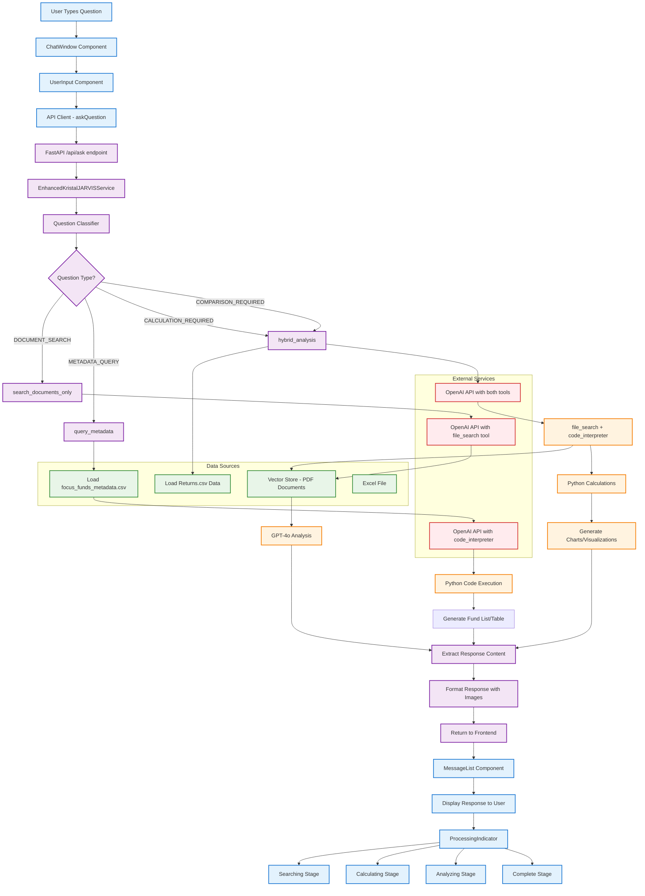
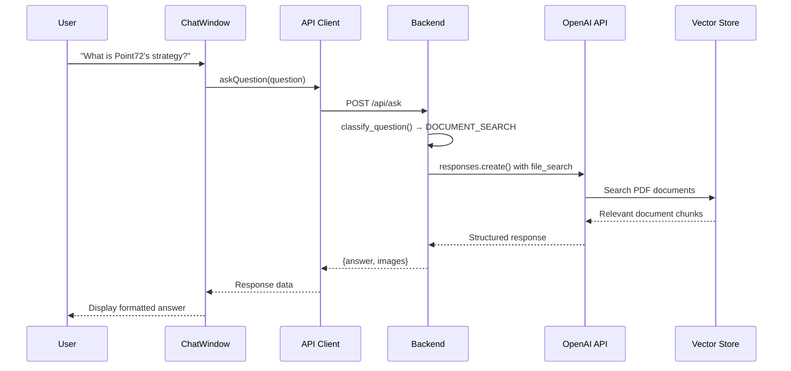
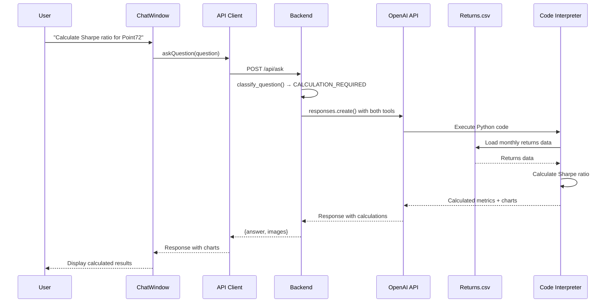
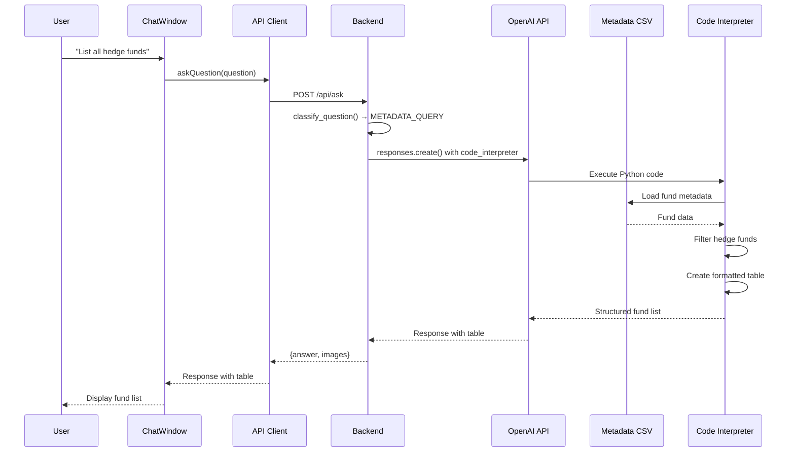
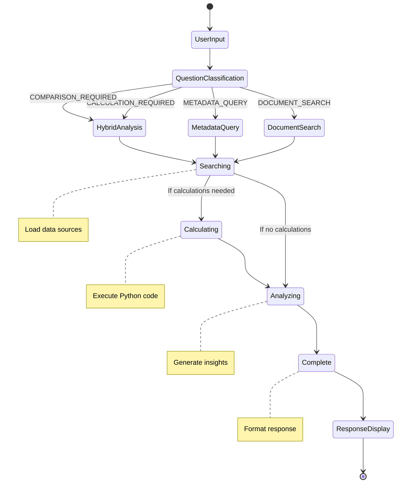
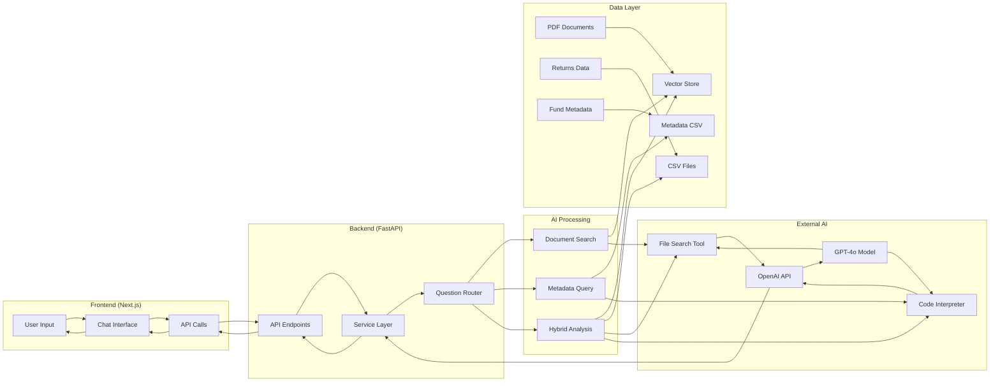

# Kristal.AI's J.A.R.V.I.S System Flow Chart

## Complete System Flow

## Detailed Information Flow Examples

### Example 1: Document Search Flow

### Example 2: Financial Calculation Flow

### Example 3: Metadata Query Flow

## Key Processing Stages

## Data Flow Architecture

