# Kristal.AI J.A.R.V.I.S System - Visual Flow Chart

## Complete System Flow (Image Format)

To view this as an image, copy the Mermaid code below and paste it into [Mermaid Live Editor](https://mermaid.live/) or any Mermaid-compatible viewer:

```mermaid
flowchart TD
    %% User Interface Layer
    subgraph "🖥️ FRONTEND LAYER"
        A[👤 User Types Question] --> B[💬 ChatWindow Component]
        B --> C[⌨️ UserInput Component]
        C --> D[🌐 API Client - askQuestion]
    end

    %% Backend Processing
    subgraph "⚙️ BACKEND LAYER"
        D --> E[🚀 FastAPI /api/ask endpoint]
        E --> F[🧠 EnhancedKristalJARVISService]
        F --> G[🔍 Question Classifier]
    end

    %% Classification Decision
    G --> H{❓ Question Type?}
    
    %% Document Search Path
    H -->|📄 DOCUMENT_SEARCH| I[📚 search_documents_only]
    I --> J[🤖 OpenAI API + file_search]
    J --> K[📁 Vector Store - PDFs]
    K --> L[🧮 GPT-4o Analysis]
    L --> M[📝 Extract Response]
    
    %% Metadata Query Path
    H -->|📊 METADATA_QUERY| N[📋 query_metadata]
    N --> O[📈 Load focus_funds_metadata.csv]
    O --> P[🤖 OpenAI API + code_interpreter]
    P --> Q[🐍 Python Code Execution]
    Q --> R[📊 Generate Fund List/Table]
    R --> M
    
    %% Hybrid Analysis Path
    H -->|🧮 CALCULATION_REQUIRED| S[🔄 hybrid_analysis]
    H -->|⚖️ COMPARISON_REQUIRED| S
    S --> T[📊 Load Returns.csv Data]
    S --> U[🤖 OpenAI API + both tools]
    U --> V[🔍 file_search + code_interpreter]
    V --> K
    V --> W[🐍 Python Calculations]
    W --> X[📈 Generate Charts/Visualizations]
    X --> M
    
    %% Response Processing
    M --> Y[🎨 Format Response + Images]
    Y --> Z[↩️ Return to Frontend]
    Z --> AA[💬 MessageList Component]
    AA --> BB[👁️ Display Response to User]
    
    %% Processing Indicators
    BB --> CC[⏳ ProcessingIndicator]
    CC --> DD[🔍 Searching Stage]
    CC --> EE[🧮 Calculating Stage]
    CC --> FF[📊 Analyzing Stage]
    CC --> GG[✅ Complete Stage]
    
    %% Data Sources
    subgraph "💾 DATA SOURCES"
        K
        O
        T
        HH[📊 Excel File]
    end
    
    %% External Services
    subgraph "🌐 EXTERNAL SERVICES"
        J
        P
        U
    end
    
    %% Styling
    classDef userInterface fill:#e3f2fd,stroke:#1976d2,stroke-width:3px,color:#000
    classDef backend fill:#f3e5f5,stroke:#7b1fa2,stroke-width:3px,color:#000
    classDef ai fill:#fff3e0,stroke:#f57c00,stroke-width:3px,color:#000
    classDef data fill:#e8f5e8,stroke:#388e3c,stroke-width:3px,color:#000
    classDef external fill:#ffebee,stroke:#d32f2f,stroke-width:3px,color:#000
    classDef decision fill:#fff9c4,stroke:#f9a825,stroke-width:3px,color:#000
    
    class A,B,C,D,AA,BB,CC,DD,EE,FF,GG userInterface
    class E,F,G,I,N,S,M,Y,Z backend
    class J,P,U,V,L,Q,W,X ai
    class K,O,T,HH data
    class J,P,U external
    class H decision
```

## Step-by-Step Process Flow

## Data Flow Architecture

```mermaid
graph LR
    subgraph "🖥️ Frontend (Next.js)"
        A[👤 User Input] --> B[💬 Chat Interface]
        B --> C[🌐 API Calls]
    end
    
    subgraph "⚙️ Backend (FastAPI)"
        C --> D[🚀 API Endpoints]
        D --> E[🧠 Service Layer]
        E --> F[🔍 Question Router]
    end
    
    subgraph "🤖 AI Processing"
        F --> G[📚 Document Search]
        F --> H[📊 Metadata Query]
        F --> I[🔄 Hybrid Analysis]
    end
    
    subgraph "💾 Data Layer"
        J[📄 PDF Documents] --> K[📁 Vector Store]
        L[📊 Returns Data] --> M[📈 CSV Files]
        N[📋 Fund Metadata] --> O[📊 Metadata CSV]
    end
    
    subgraph "🌐 External AI"
        P[🤖 OpenAI API] --> Q[🧠 GPT-4o Model]
        Q --> R[🔍 File Search Tool]
        Q --> S[🐍 Code Interpreter]
    end
    
    G --> K
    G --> R
    H --> O
    H --> S
    I --> K
    I --> M
    I --> R
    I --> S
    
    R --> P
    S --> P
    
    P --> E
    E --> D
    D --> C
    C --> B
    B --> A
```

## How to Convert to Image:

1. **Copy the Mermaid code** from any of the diagrams above
2. **Go to [Mermaid Live Editor](https://mermaid.live/)**
3. **Paste the code** in the left panel
4. **Click "Export"** and choose PNG, SVG, or PDF format
5. **Download the image** to your device

## Key System Components:

- 🖥️ **Frontend**: Next.js 15 with React components
- ⚙️ **Backend**: FastAPI with Python services
- 🤖 **AI Processing**: OpenAI GPT-4o with specialized tools
- 💾 **Data Sources**: PDFs, CSVs, Excel files
- 🔍 **Question Classification**: Routes to appropriate processing
- 📊 **Response Generation**: Formatted answers with visualizations
